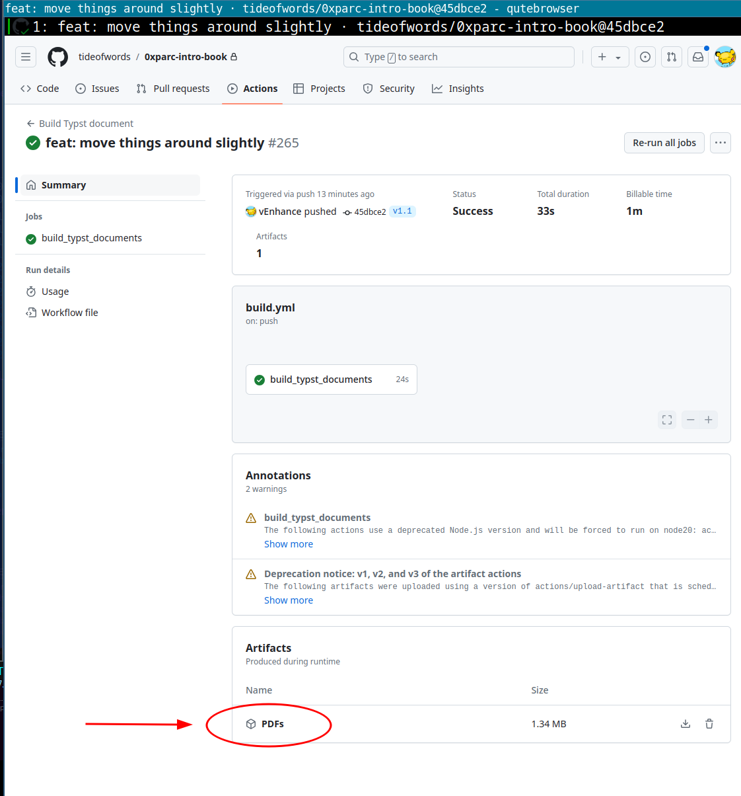

# Introduction to Programmable Cryptography

This is an attempt at an introductory lecture notes on programmable cryptography.
It is developed by [0xPARC](https://0xparc.org/).
The source files are written in [Typst](https://typst.app).

## Downloading the book

- If you want the latest **tagged** version (i.e. that has a release number),
  check the [Releases page](https://github.com/tideofwords/0xparc-intro-book/releases/).
  We tag the versions of the book as they reach certain milestones,
  e.g. just before we send them off to the printer.

- If you want to download the compiled book as of the latest commit,
  go under the [Actions page](https://github.com/tideofwords/0xparc-intro-book/actions)
  and click the most recent commit.
  Scroll down until you see the section titled "Artifacts" and
  click the link labeled "PDF".

## Spot a typo? Have a suggestion?

Please open a [GitHub issue](https://github.com/tideofwords/0xparc-intro-book/issues)!
